# NextFlowNYC

## Introduction

This project delves into the analysis and forecasting of automated traffic volume counts in New York City. Utilizing a dataset spanning from 2011 to 2020, sourced from Kaggle's "NYC Automated Traffic Volume Counts" dataset, this project aims to uncover patterns, trends, and insights into traffic dynamics. The primary focus is on developing and evaluating time series forecasting models to predict future traffic volumes accurately.

**Disclaimer:** This project is primarily a learning exercise and for practice purposes. While significant effort has been made to ensure accuracy and derive meaningful insights, it may contain errors. Corrections and contributions are highly welcomed as this is an ongoing process of learning and improvement. The insights and models presented herein are, to the best of my knowledge, sound and can be beneficial for those looking to learn about time series analysis and forecasting.

## Dataset

The dataset employed in this project originates from the NYC Department of Transportation and is publicly available on Kaggle: [NYC Automated Traffic Volume Counts](https://www.kaggle.com/datasets/aadimator/nyc-automated-traffic-volume-counts). It encompasses a decade of traffic data, providing a rich foundation for analysis and model development.

### Features

The dataset includes the following key features:

*   **RequestID:** A unique identifier for each traffic count request.
*   **Boro:** The borough (administrative division) of NYC where the traffic count was taken (e.g., Manhattan, Brooklyn).
*   **Yr, M, D:** Year, Month, and Day of the traffic count.
*   **HH, MM:** Hour and Minute when the count was conducted.
*   **Vol:** The total traffic volume within a 15-minute interval.
*   **SegmentID:** An identifier for each street segment in the LION street network.
*   **WktGeom:** Well-Known Text representation of the geographic location.
*   **street:** The name of the street where the count was taken.
*   **fromSt, toSt:** The nearest cross streets defining the segment.
*   **Direction:** The direction of traffic flow (e.g., NB for Northbound).

## Project Workflow

The project follows a systematic workflow, encompassing the following stages:

### 1. Data Acquisition and Preprocessing

*   **Data Download:** The dataset was downloaded directly from Kaggle using the Kaggle API.
*   **Data Extraction:** The downloaded archive (if applicable) was extracted to access the CSV files.
*   **Data Loading:** The CSV files (one for each year) were loaded into pandas DataFrames.
*   **Data Cleaning and Preprocessing:**
    *   Irrelevant columns (`RequestID`, `Boro`, `WktGeom`, `street`, `fromSt`, `toSt`) were dropped.
    *   Data was sorted chronologically based on `SegmentID`, `Direction`, and `Datetime`.
    *   A `Datetime` column was created by combining `Yr`, `M`, `D`, `HH`, and `MM`.
    *   Entries with invalid `Vol` (-1) were removed.
    *   Direction was encoded numerically (e.g., NB: 0, WB: 1).
    *   `Datetime`, `SegmentID`, and `Direction` were set as the index.
    *   Duplicate indices were removed, and missing values (NaNs) were handled (e.g., dropped).
    *   Outliers in the `Vol` column were removed based on the 99th percentile.
    *   The `Vol` column was MinMax scaled for better model training
    *   Volume was incremented by 1 to avoid scaling issues with zero values
### 2. Exploratory Data Analysis (EDA)

*   **Dataset Preview:** The first few rows of each yearly dataset were displayed to get an initial understanding of the data.
*   **Dataset Information:** Data types and missing values were inspected using `data.info()`.
*   **Summary Statistics:** Descriptive statistics of the `Vol` column were calculated (count, mean, std, min, quartiles, max) for each year and grouped by `SegmentID` and `Direction`.
*   **Visualizations:**
    *   Time series plots of `Vol` vs. `Datetime` were generated for each year to observe overall trends and seasonality.
    *   Histograms or distribution plots of `Vol` were created to understand the distribution of traffic volumes.
*   **Unique Segments Analysis:** The number of unique street segments (`SegmentID`) was counted for each year to assess data consistency across years.

### 3. Feature Engineering

*   **Sequence Creation:** The `Vol` column was transformed into sequences of a fixed length (`TIME_STEPS`) to prepare the data for time series modeling. The `as_strided` function from NumPy was used for efficient sequence generation.

*   **Note on Sequence Mixing:** 
    * The method of creating sequences by traversing through ordered SegmentID values inevitably mixes data from different street segments within a single sequence. This may introduce some noise, as traffic patterns on different streets are not always perfectly correlated. However, for this learning-focused project, we believe this approach is acceptable. The goal is not perfect prediction accuracy but rather to estimate traffic volume levels reasonably, effectively treating the problem as a classification task (e.g., high, medium, low traffic) indirectly rather than predicting exact values.
    * Due to the large dataset and limited computational resources, this approach was adopted. With separation and processing of sequences for each segment individually, it may be possible to develop significantly improved models by capturing segment-specific traffic patterns more effectively.

### 4. Model Building and Training

*   **Model Architecture:** A Bidirectional LSTM (Long Short-Term Memory) recurrent neural network was chosen for its ability to capture temporal dependencies in sequential data.
*   **Model Definition:** A Keras `Sequential` model was defined with the following layers:
    *   Input layer
    *   Bidirectional LSTM layer (64 units, `return_sequences=True`)
    *   Batch Normalization layer
    *   Dropout layer (rate=0.2)
    *   Bidirectional LSTM layer (32 units, `return_sequences=False`)
    *   Batch Normalization layer
    *   Dense layer (16 units, ReLU activation)
    *   Dense layer (1 unit, ReLU activation)
*   **Optimizer:** Adam optimizer with a learning rate of 0.001.
*   **Loss Function:** Mean Squared Error (MSE)
*   **Metrics:** Mean Absolute Error (MAE)
*   **Training Process:**
    *   Data was split into training and validation sets, either chronologically or randomly.
    *   Generators were used to create batches of input sequences (X) and target values (y) for efficient training.
    *   A `ModelCheckpoint` callback was implemented to save the best model during training based on validation loss.
    *   The model was trained using `model.fit()`, with specified `epochs` and `steps_per_epoch`.
    *   Training history (loss and MAE) was recorded for each epoch.

### 5. Model Evaluation

*   **Test Data Preparation:** Test data for a specific year was prepared using the same preprocessing and sequence creation steps as the training data.
*   **Prediction Generation:** The trained model was used to generate predictions on the test sequences using `model.predict()`.
*   **Denormalization:** The predicted volumes (which were scaled during preprocessing) were converted back to the original scale using the inverse transform of the `MinMaxScaler`.
*   **Metrics Calculation:** The following metrics were calculated to evaluate the model's performance:
    *   Mean Absolute Error (MAE)
    *   Mean Absolute Percentage Error (MAPE)
    *   Root Mean Squared Error (RMSE)
    *   Median Absolute Error (MedAE)
    *   R-squared (R2) Score
*   **Results Visualization:** A plot of actual vs. predicted traffic volumes was generated to visually assess the model's accuracy.
*   **Results Tabulation:** The evaluation metrics were presented in a tabular format for each tested year.

## Results and Insights

Three different models were trained and evaluated in this project: **t-6**, **u-12**, and **v-18**. These models represent variations in training parameters, specifically the batch size used during training. The models were trained on data from 2011-2016 and tested on data from 2017-2020.

The following table summarizes the key evaluation metrics (Mean Absolute Error (MAE), Mean Absolute Percentage Error (MAPE), Root Mean Squared Error (RMSE), Median Absolute Error (MedAE), and R-squared (R2) Score) for each model on the test datasets:

| Year |   Model  |   MAE  |   MAPE   |   RMSE   |  MedAE   | R2 Score  |
| :--- | :------: | :-----: | :------: | :------: | :------: | :--------: |
| 2017 |   t-6    | 14.016  | 0.752    | 25.921   |   9.0    |  0.957    |
| 2017 |   u-12   | 12.678  | 0.408    | 23.388   |   7.0    |  0.965    |
| 2017 |   v-18   | 12.249  | 0.374    | 23.201   |   7.0    |  0.966    |
| 2018 |   t-6    | 14.073  | 1.024    | 26.784   |   8.0    |  0.955    |
| 2018 |   u-12   | 12.583  | 0.554    | 24.418   |   7.0    |  0.962    |
| 2018 |   v-18   | 12.195  | 0.462    | 24.571   |   7.0    |  0.963    |
| 2019 |   t-6    | 13.893  | 0.709    | 24.476   |   9.0    |  0.962    |
| 2019 |   u-12   | 12.518  | 0.358    | 22.166   |   8.0    |  0.969    |
| 2019 |   v-18   | 12.250  | 0.301    | 22.015   |   7.0    |  0.969    |
| 2020 |   t-6    | 13.027  | 0.525    | 23.257   |   8.0    |  0.966    |
| 2020 |   u-12   | 11.748  | 0.340    | 20.400   |   7.0    |  0.974    |
| 2020 |   v-18   | 11.318  | 0.276    | 20.331   |   6.0    |  0.974    |

### Observations

* **Model t-6 (Batch Size 32):** Consistently showed higher errors (MAE, MAPE, RMSE) and slightly lower R2 scores compared to the other two models.
* **Model u-12 (Batch Size 256):** Demonstrated improved performance over t-6, with lower error metrics and higher R2 scores.
* **Model v-18 (Batch Size 1024):** Achieved the best overall performance, exhibiting the lowest error rates and the highest R2 scores across all test years.

### Visualizations

Below are the plots of actual vs. predicted traffic volumes for each model and each test year. These visualizations provide a more intuitive understanding of the model's performance.

#### MODEL t-6 2017
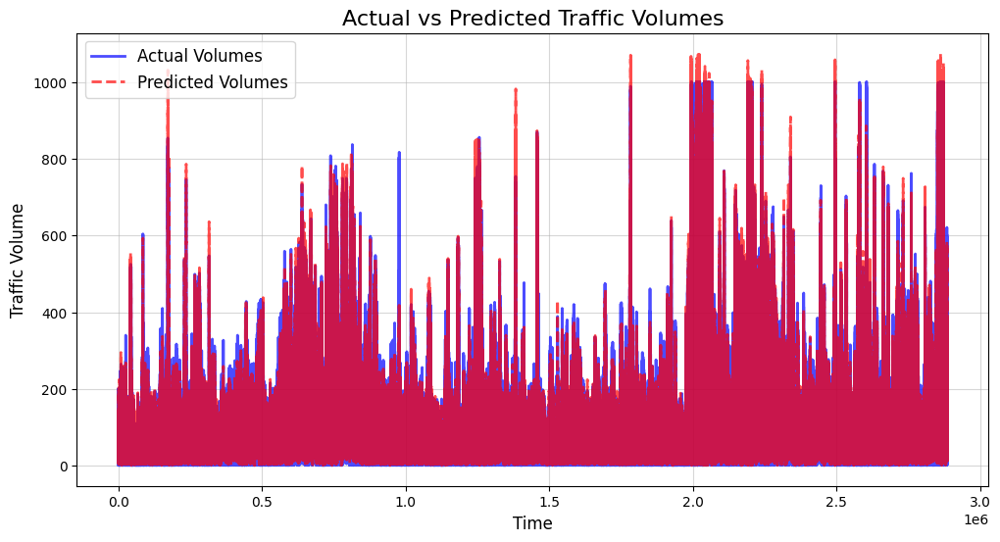

#### MODEL u-12 2017
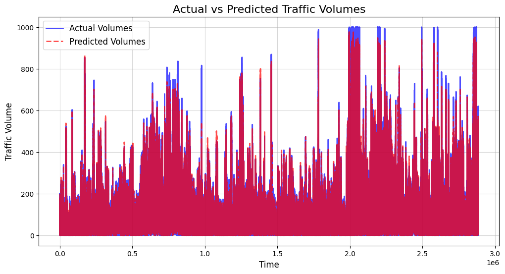

#### MODEL v-18 2017
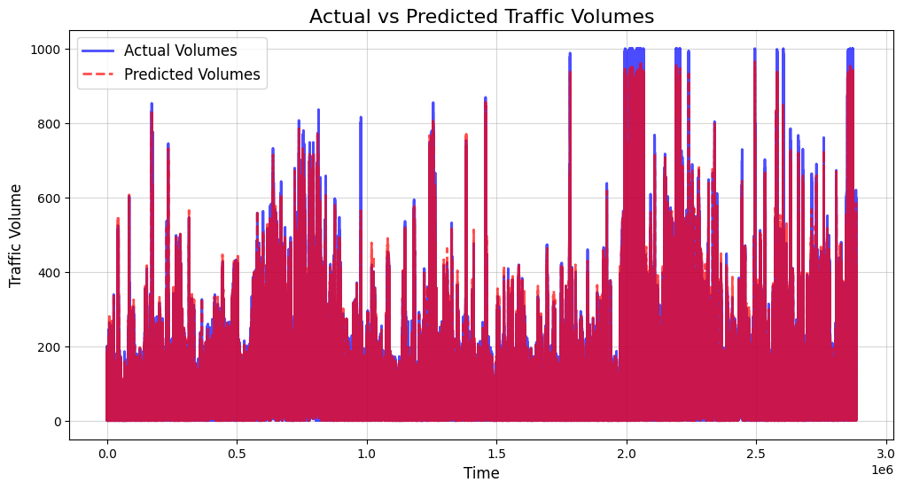

---

#### MODEL t-6 2018
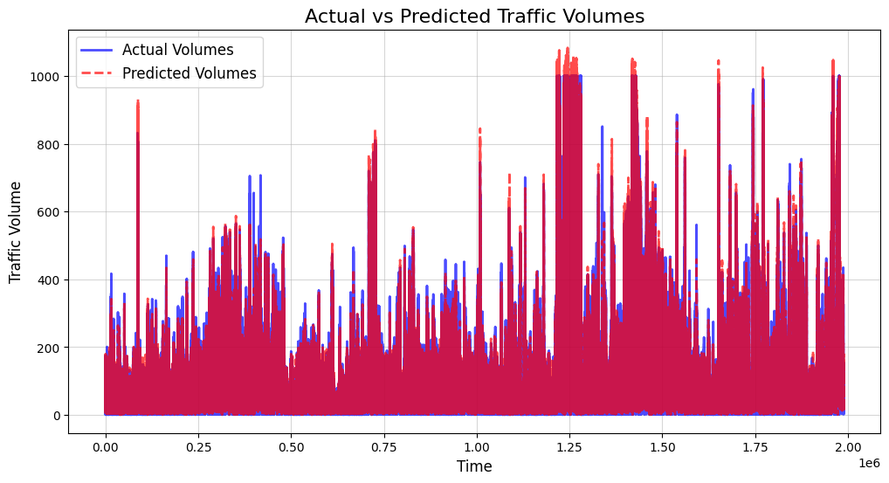

#### MODEL u-12 2018
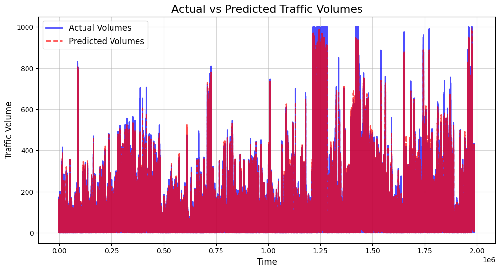

#### MODEL v-18 2018
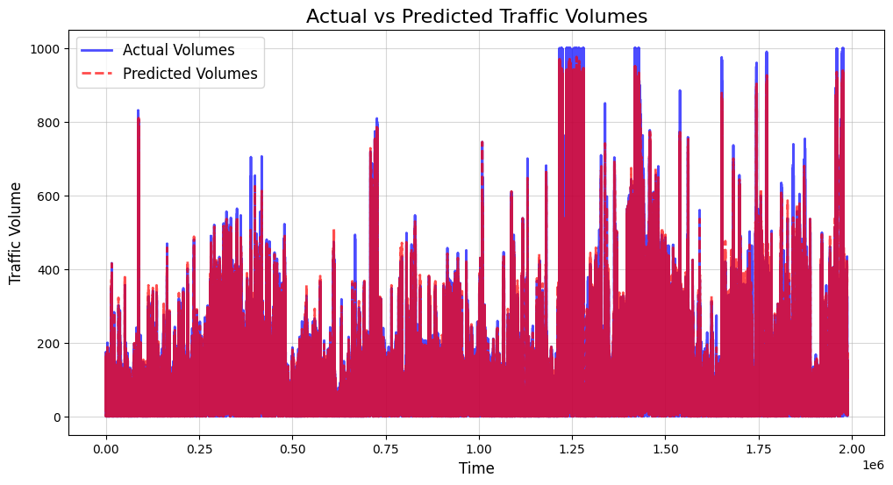

---

#### MODEL t-6 2019
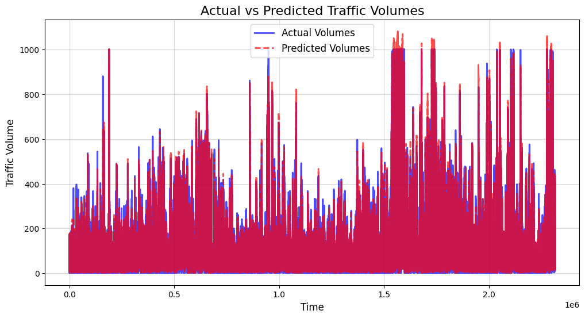

#### MODEL u-12 2019
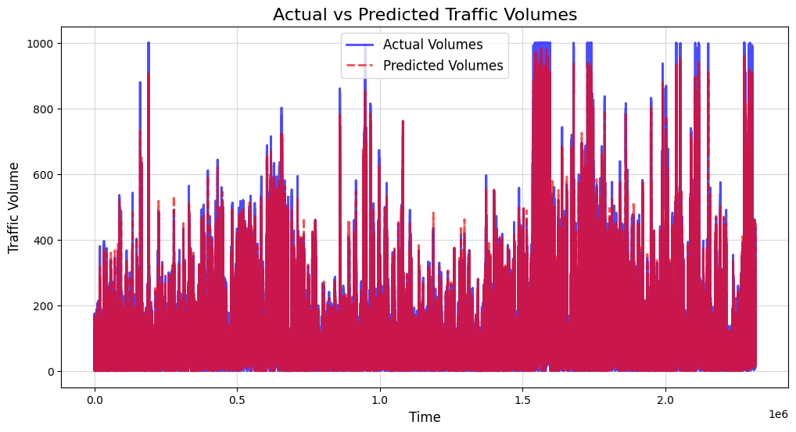

#### MODEL v-18 2019
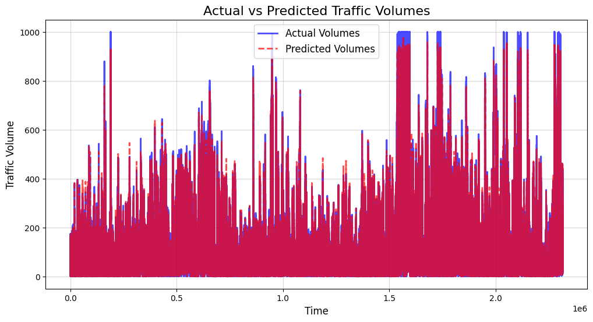

---

#### MODEL t-6  2020
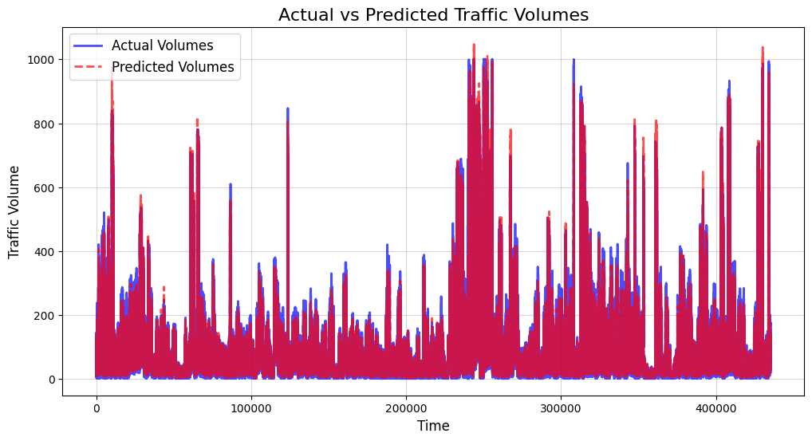

#### MODEL u-12 2020
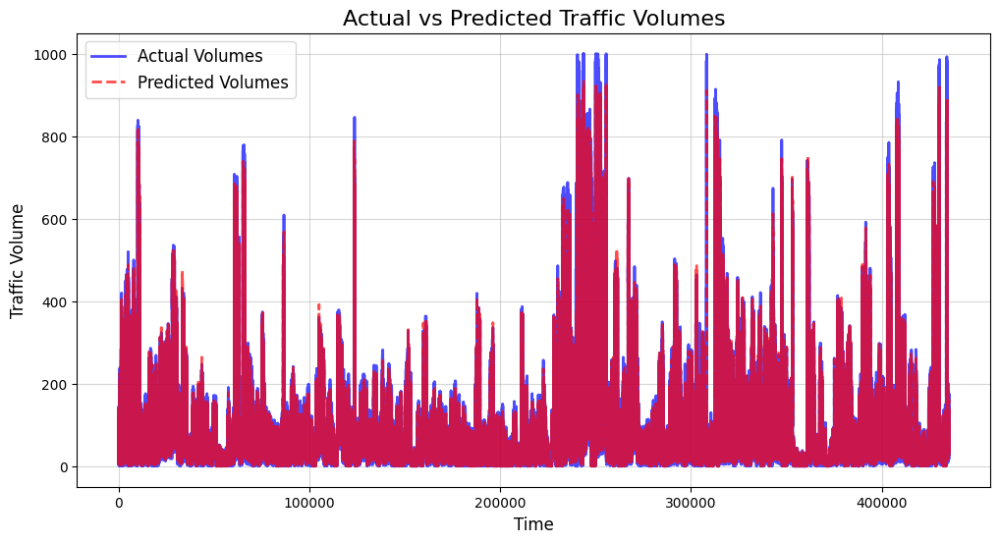

#### MODEL v-18 2020
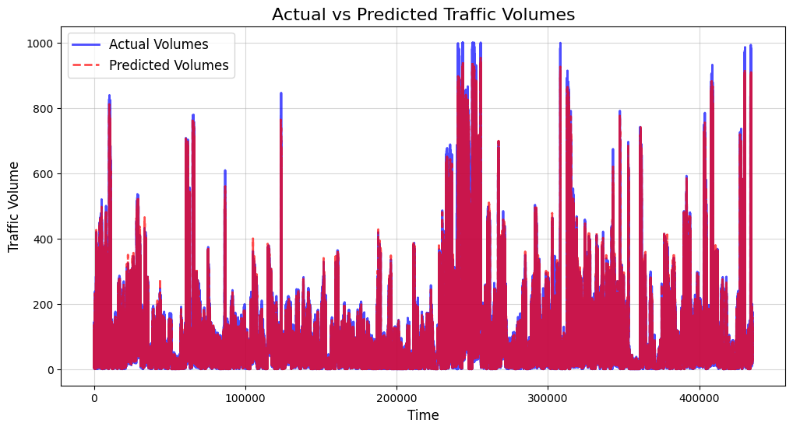

### Best Performing Model

Based on the evaluation metrics, **model v-18, trained with a batch size of 1024, emerged as the best-performing model**. It consistently outperformed the other two models in terms of accuracy and variance explanation.

### Data Analysis Insights

*   **Volume Distribution:** The distribution of traffic volumes is generally right-skewed, with a high frequency of lower volumes and a long tail of higher volumes.
*   **Temporal Trends:** The time series plots reveal clear daily and weekly seasonality in traffic patterns. There are also noticeable differences in traffic volumes across different years, potentially due to factors like economic conditions, infrastructure changes, and special events.
*   **Segment Variability:** The number of unique street segments varies across years, possibly indicating changes in the data collection methodology or the street network itself.
*   **Outlier Impact:** The presence of outliers (very high or very low volumes) highlights the importance of data preprocessing and outlier handling techniques for accurate modeling.

### Model Training Insights

*   **Batch Size Influence:** Increasing the batch size during training (from 32 to 256 and then to 1024) resulted in a notable improvement in model performance, particularly in terms of reducing the validation loss. This suggests that larger batch sizes allowed the model to learn more effectively from the training data.
*   **Epoch Impact:**  Training for more than one epoch did not significantly improve performance in later trials. This could indicate that the model converged quickly or that more complex architectures are needed to capture additional nuances in the data.

## Conclusion and Future Work

This project demonstrates the use of Bidirectional LSTM networks for forecasting traffic volume in New York City. Model v-18, trained with a larger batch size, achieved superior results, effectively capturing underlying patterns and dependencies in the data. These findings highlight the model's potential for real-world applications in traffic management and urban planning.

**Future directions for this project could include:**

*   **Hyperparameter Tuning:** Experimenting with different model architectures, optimizers, learning rates, and other hyperparameters to further improve performance.
*   **Feature Engineering:** Incorporating additional features, such as weather data, holidays, special events, or traffic incidents, to enhance the model's predictive power.
*   **Spatial Analysis:** Exploring spatial relationships between street segments and traffic patterns using the `WktGeom` data.
*   **Model Interpretability:** Applying techniques to better understand the factors driving the model's predictions.
*   **Deployment:** Developing a web application or API to make the forecasting model accessible to a wider audience.
*   **Evaluation with external metrics:** Testing the models predictions with external factors to provide a more comprehensive evaluation of its capabilities and robustness in diverse scenarios.
